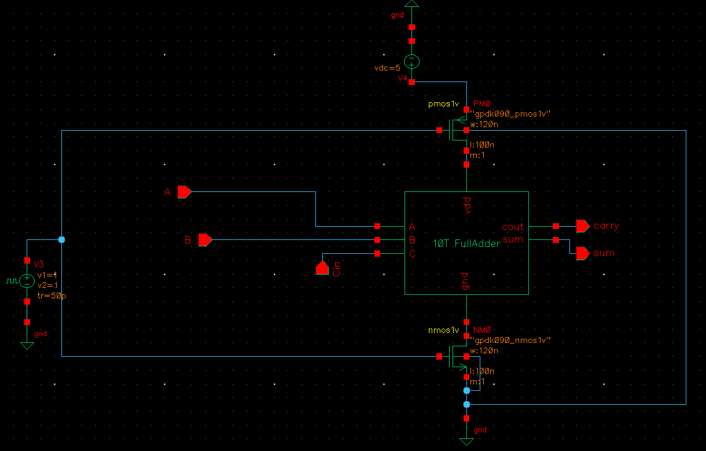
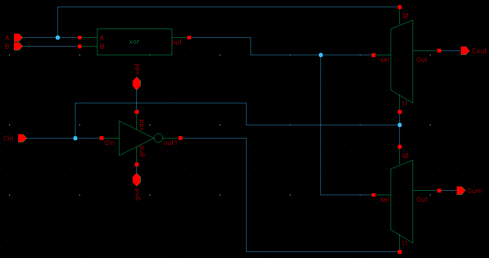
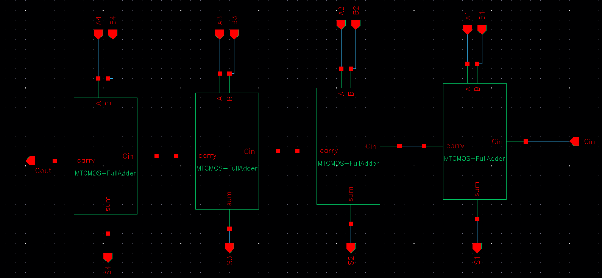
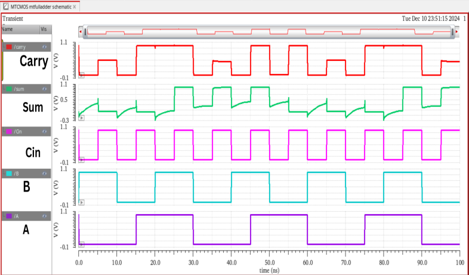

# MTCMOS-Based 4-Bit Ripple Carry Adder

This project presents the **design and simulation** of a **4-bit Ripple Carry Adder (RCA)** using **MTCMOS-based 10T Full Adders**, implemented in **Cadence Virtuoso**.

By cascading four optimized 10-transistor full adders with **MTCMOS power-gating**, we achieve:
- ✅ Lower power consumption
- ✅ Faster computation speed
- ✅ Significant transistor reduction

---

## 💡 MTCMOS Technique – Recap

**MTCMOS (Multi-Threshold CMOS)** uses:
- **Low-Vt transistors** in logic paths for speed
- **High-Vt sleep transistors** to cut leakage during idle time

This design leverages MTCMOS to build an energy-efficient 4-bit adder suitable for low-power VLSI systems.

---

## 🧩 Module Breakdown

### 1️⃣ MTCMOS 10T Full Adder
- Forms the building block of the RCA
- Optimized for power and delay using MTCMOS

### 2️⃣ 4-Bit Ripple Carry Adder
- Built by cascading 4 Full Adders
- Carry-out from each FA connects to carry-in of next
- Minimal interconnect logic; symbol-based design used in Virtuoso

---

## 🔧 Tools Used

| Tool              | Purpose                       |
|-------------------|-------------------------------|
| Cadence Virtuoso  | Schematic & Symbol Design     |
| Spectre Simulator | Circuit Simulation            |
| 90nm CMOS Library | Standard Cell Modeling        |

---

## 📷 Schematic Snapshots

### 🔧 MTCMOS 10T Full Adder  

### 🔲 10T Full Adder  

### 🧠 4-Bit RCA Schematic  

### 📈 Simulation Output  

---

## 📊 Simulation Results

| Parameter           | Value       |
|---------------------|-------------|
| Power Consumption   | 0.93 µW     |
| Propagation Delay   | 89 ps       |
| Transistor Count    | ~40         |
| Technology Node     | 90nm        |

